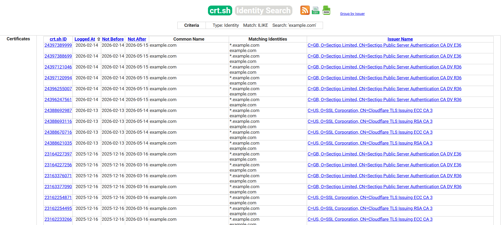

# 攻击面识别

## 概要

识别 Web 应用程序的攻击面涉及发现与目标基础设施相关联的所有应用程序、域名、虚拟主机和外部暴露的服务。此过程不仅限于识别托管的应用程序，还包括 DNS 枚举、子域名发现、虚拟主机分析、非标准端口以及数字证书和证书透明度日志的审查。

随着虚拟主机和共享基础设施的普及，IP 地址与 Web 服务器之间传统的 1:1 关系已基本消失。单个 IP 地址可能在不同域、环境或管理界面上托管多个应用程序。未能识别这些资产可能导致评估不完整和漏洞被忽略。

安全专业人员有时会获得一组 IP 地址作为测试目标。这种场景更像渗透测试类型的参与，但无论如何，期望此类任务测试通过该目标可访问的所有 Web 应用程序。问题是，给定的 IP 地址在端口 80 上提供 HTTP 服务，但如果测试人员通过指定 IP 地址（这是他们所知的所有信息）访问它，则会报告“此地址未配置 Web 服务器”或类似消息。但该系统可能“隐藏”了许多与无关符号（DNS）名称相关联的 Web 应用程序。显然，分析的深度受到测试人员是测试所有应用程序还是仅测试他们知道的应用程序的严重影响。

有时，测试人员可能会获得一个 IP 地址列表及其对应的符号名称。然而，此列表可能包含部分信息，即可能遗漏一些符号名称

影响评估范围的其他问题还包括以非显而易见 URL（例如 `https://www.example.com/some-strange-URL`）发布的 Web 应用程序，这些 URL 在其他地方未被引用。这可能由于错误（配置错误）或故意（例如，未公开的管理界面）而发生。

为了解决这些问题，必须执行全面的攻击面识别过程。

## 测试目标

- 枚举范围内的所有 Web 应用程序。
- 识别与目标关联的 DNS 名称、域名和虚拟主机。
- 使用被动和主动 DNS 技术发现额外的域名和子域名。
- 分析数字证书和证书透明度日志以获取更多主机名。

## 如何测试

Web 应用程序发现是一个旨在识别给定基础设施上 Web 应用程序的过程。基础设施通常指定为一组 IP 地址（可能是一个网段），但也可以由一组 DNS 符号名称或两者的混合组成。评估应力求在范围上最全面，即应识别通过给定目标可访问的所有应用程序

> 以下某些技术适用于面向互联网的 Web 服务器，即 DNS 和基于反向 IP 的 Web 搜索服务以及搜索引擎的使用。示例使用私有 IP 地址（如 `192.168.1.100`），除非另有说明，这些地址代表*通用* IP 地址，仅用于匿名目的。

影响与给定 DNS 名称（或 IP 地址）相关的应用程序数量的因素有三个：

1. **不同的基础 URL**

    Web 应用程序的明显入口点是 `www.example.com`，即使用这个简写符号，我们认为 Web 应用程序起始于 `https://www.example.com/`（HTTPS 同样适用）。然而，尽管这是最常见的情况，但没有任何强制要求应用程序从 `/` 开始。

    例如，同一个符号名称可能与三个 Web 应用程序相关联，如：`https://www.example.com/app1`、`https://www.example.com/app2`、`https://www.example.com/app3`

    在这种情况下，URL `https://www.example.com/` 不会关联到有意义的页面。除非测试人员明确知道如何访问它们，否则这三个应用程序将保持**隐藏**，即测试人员知道 *app1*、*app2* 或 *app3*。通常没有必要以这种方式发布 Web 应用程序，除非所有者不希望它们以标准方式被访问，并准备告知用户其确切位置。这并不意味着这些应用程序是秘密的，只是它们的存在和位置没有被明确宣传。

2. **非标准端口**

    虽然 Web 应用程序通常位于端口 80（HTTP）和 443（HTTPS）上，但这些端口号并非固定或强制性的。事实上，Web 应用程序可以与任意 TCP 端口相关联，并且可以通过如下指定端口号来引用：`http[s]://www.example.com:port/`。例如，`https://www.example.com:20000/`。

3. **虚拟主机**

    DNS 允许单个 IP 地址与一个或多个符号名称相关联。例如，IP 地址 `192.168.1.100` 可能与 DNS 名称 `www.example.com`、`helpdesk.example.com`、`webmail.example.com` 相关联。并非所有名称都需要属于同一个 DNS 域。这种 1:N 关系可以通过使用所谓的虚拟主机来反映，以提供不同的内容。指定我们正在引用的虚拟主机的信息嵌入在 HTTP 1.1 [Host 头](https://datatracker.ietf.org/doc/html/rfc7230#section-5.4)中。

    除了明显的 `www.example.com` 之外，人们不会怀疑其他 Web 应用程序的存在，除非他们知道 `helpdesk.example.com` 和 `webmail.example.com`。

### 解决第 1 个问题（非标准 URL）的方法

没有办法完全确定非标准命名的 Web 应用程序的存在。由于它们是非标准的，没有固定标准来管理命名约定，但是测试人员可以使用一些技术来获得更多洞察。

首先，如果 Web 服务器配置错误并允许目录浏览，则有可能发现这些应用程序。漏洞扫描器在这方面可能会有所帮助。

其次，这些应用程序可能被其他网页引用，并且它们有可能已被网络搜索引擎爬取和索引。如果测试人员怀疑 `www.example.com` 上存在此类**隐藏**应用程序，他们可以使用 *site* 运算符进行搜索，并检查 `site: www.example.com` 查询的结果。在返回的 URL 中，可能有一个指向此非显而易见应用程序的 URL。

另一种选择是探测可能是未公开应用程序候选的 URL。例如，Web 邮件前端可能可以从诸如 `https://www.example.com/webmail`、`https://webmail.example.com/` 或 `https://mail.example.com/` 等 URL 访问。管理界面也是如此，它们可能发布在隐藏的 URL 上（例如 Tomcat 管理界面），并且没有在任何地方被引用。因此，进行一些字典式搜索（或“智能猜测”）可能会产生一些结果。漏洞扫描器在这方面可能会有所帮助。

### 解决第 2 个问题（非标准端口）的方法

检查非标准端口上是否存在 Web 应用程序很容易。诸如 Nmap 之类的端口扫描器能够通过 `-sV` 选项执行服务识别，并识别任意端口上的 `HTTP[S]` 服务。所需的是对整个 64k TCP 端口地址空间进行全面扫描（默认扫描常见端口）。

例如，以下命令将使用 TCP 连接扫描查找 IP `192.168.1.100` 上的所有开放端口，并尝试确定绑定到这些端口的服务：

`nmap –Pn –sT –sV –p0-65535 192.168.1.100`

只需检查输出并查找 HTTP 或 TLS 封装服务的指示（应探测以确认它们是 HTTPS）即可。

对于未指定服务：
- 手动 telnet
- Web 浏览器访问 URL
- 或者使用 GET 或 HEAD Perl 命令

### 解决第 3 个问题（虚拟主机）的方法

有许多技术可用于识别与给定 IP 地址 `x.y.z.t` 关联的 DNS 名称。

#### DNS 枚举

DNS 枚举旨在识别与目标组织关联的域、子域和相关 DNS 记录，以扩展评估范围。DNS 枚举在识别映射到同一 IP 地址的附加虚拟主机方面发挥着关键作用。这可以揭示开发系统、预发布环境、遗留服务或管理界面。

可以使用被动和主动技术。

#### 被动 DNS 枚举

被动技术不直接与目标基础设施交互，而是依赖公开可用的数据源。示例包括：

- 公共 DNS 记录（A、AAAA、MX、TXT、NS）
- 反向 DNS 查找（PTR 记录）
- 搜索引擎
- 被动 DNS 数据库
- 证书透明度日志

在早期侦察阶段首选被动技术以避免检测。

#### 主动 DNS 枚举

主动技术直接查询目标的 DNS 基础设施，并可能在目标系统上生成日志。这些包括：

- 子域名暴力破解
- DNS 区域传输尝试
- 使用工具进行 DNS 记录枚举

用于 DNS 枚举的常用工具包括：

- `amass` DNS 区域传输、证书解析、搜索引擎和子域数据库
- `subfinder`
- `dnsrecon`
- `fierce`
- `dig`
- `nslookup`
- `Sublist3r` 查询搜索引擎和在线子域数据库
- `SubBrute` 暴破子域
- `Gobuster`
- `Altdns` 生成大量“改变”或“变异”的潜在子域

#### DNS 区域传输

这种技术如今使用有限，因为 DNS 服务器很大程度上不接受区域传输。然而，仍然值得尝试。首先，测试人员必须确定服务于 `x.y.z.t` 的名称服务器。如果 `x.y.z.t` 的符号名称已知（假设为 `www.example.com`），则可以通过 `nslookup`、`host` 或 `dig` 等工具请求 DNS NS 记录来确定其名称服务器。

如果 `x.y.z.t` 没有已知的符号名称，但目标定义至少包含一个符号名称，测试人员可以尝试应用相同的过程并查询该名称的名称服务器（希望 `x.y.z.t` 也由该名称服务器提供服务）。例如，如果目标由 IP 地址 `x.y.z.t` 和名称 `mail.example.com` 组成，请确定域 `example.com` 的名称服务器。

以下示例显示了如何使用 `host` 命令识别 `www.owasp.org` 的名称服务器：

```bash
$ host -t ns www.owasp.org
www.owasp.org is an alias for owasp.org.
owasp.org name server ns1.secure.net.
owasp.org name server ns2.secure.net.
```

现在可以向域 `example.com` 的名称服务器请求区域传输。如果测试人员幸运的话，他们可能会收到该域名的 DNS 条目列表作为响应。这将包括明显的 `www.example.com` 和不那么明显的 `helpdesk.example.com` 和 `webmail.example.com`（可能还有其他）。检查区域传输返回的所有名称，并考虑所有与被评估目标相关的名称。

尝试从其名称服务器之一请求 `owasp.org` 的区域传输：

```bash
$ host -l www.owasp.org ns1.secure.net
Using domain server:
Name: ns1.secure.net
Address: 192.220.124.10#53
Aliases:

Host www.owasp.org not found: 5(REFUSED)
; Transfer failed.
```

#### DNS 反向查询

查询 NS 服务器
    此过程与前一个类似，但依赖于反向（PTR）DNS 记录。不请求区域传输，而是尝试将记录类型设置为 PTR 并对给定 IP 地址发出查询。如果测试人员幸运的话，他们可能会收到一个 DNS 名称条目作为响应。此技术依赖于 IP 到符号名称映射的存在，但这并不保证。

使用 Web 服务的正向 DNS 查询
   这些服务支持基于名称的 DNS 搜索。
- Netcraft [Search DNS](https://searchdns.netcraft.com/?host) 查询属于所选域的名称列表，例如 `example.com`。然后，他们将检查获得的名称是否与他们正在检查的目标相关。

使用 Web 服务的反向 DNS 查询
    有许多这样的服务可用。由于它们倾向于返回部分（且通常不同）的结果，最好使用多个服务以获得更全面的分析。

- [MxToolbox Reverse IP](https://mxtoolbox.com/ReverseLookup.aspx)
- [DNSstuff](https://www.dnsstuff.com/)（提供多种服务）
- [Net Square](https://web.archive.org/web/20190515092354/https://www.net-square.com/mspawn.html)（对域和 IP 地址进行多次查询，需要安装）

#### 谷歌搜索

根据之前技术的信息收集，测试人员可以依赖搜索引擎来可能完善和增加他们的分析。这可能会产生属于目标的额外符号名称或通过非显而易见的 URL 访问的应用程序的证据。

例如，考虑前面关于 `www.owasp.org` 的例子，测试人员可以查询 Google 和其他搜索引擎，寻找与 `webgoat.org`、`webscarab.com` 和 `webscarab.net` 等新发现的域相关的信息（从而得到 DNS 名称）。

谷歌搜索技术见`1. 信息搜集 - 1. 被动搜索引擎侦察`小节

#### 数字证书

如果服务器接受 HTTPS 连接，则证书上的通用名称（CN）和主题备用名称（SAN）可能包含一个或多个主机名。但是，如果 Web 服务器没有受信任的证书，或者使用了通配符，则这可能不会返回任何有效信息。

可以通过手动检查证书或使用其他工具（如 OpenSSL）获取 CN 和 SAN：

```sh
openssl s_client -connect 93.184.216.34:443 </dev/null 2>/dev/null | openssl x509 -noout -text | grep -E 'DNS:|Subject:'

Subject: C = US, ST = California, L = Los Angeles, O = Internet Corporation for Assigned Names and Numbers, CN = www.example.org
DNS:www.example.org, DNS:example.com, DNS:example.edu, DNS:example.net, DNS:example.org, DNS:www.example.com, DNS:www.example.edu, DNS:www.example.net
```

#### TLS 证书透明度日志

证书透明度（CT）日志是已颁发 TLS 证书的公开可访问记录。可以搜索这些日志以识别与目标组织关联的主机名和子域名，包括预发布系统、管理界面、遗留系统或其他外部可访问的服务。

审查 CT 日志可能会揭示通过 DNS 区域传输、反向查找或搜索引擎查询无法直接发现的主机名。测试人员应提取发现的主机名，并通过 DNS 解析进行验证，以确定它们是否活跃且在评估的定义范围内。

在审查 CT 日志数据时，请考虑：

- 指示开发、预发布或测试环境的主机名。
- 管理或管理界面。
- 可能仍然可访问的已弃用或遗留系统。
- 可能暗示额外未发现子域名的通配符证书。

从 CT 日志收集的信息应在进一步测试之前进行验证，以确认所有权和相关性。

查询 CT 日志的一种常见方法是使用聚合证书数据的公开搜索门户。例如，测试人员可以搜索颁发给 `example.com` 的证书，并查看列出的子域名。

例如：`https://crt.sh/?q=%25.example.com`

  

*图 4.1.4-1：证书透明度日志搜索结果示例。*

结果可能列出子域名，如 `dev.example.com`、`staging.example.com` 或其他未直接从主站点引用的主机名。发现的主机名应在进一步测试之前通过 DNS 解析进行验证。

工具：
- crt.sh
- Censys
- Cert Spotter

## 工具

- DNS 查找工具，如 `nslookup`、`dig` 和 `host`
- 子域名枚举工具，如 `amass`、`subfinder`、`dnsrecon` 和 `fierce`
- 搜索引擎（Google、Bing 和其他主要搜索引擎）
- 反向 IP 查找服务
- [Nmap](https://nmap.org/)
- [Nessus 漏洞扫描器](https://www.tenable.com/products/nessus)
- [Nikto](https://github.com/sullo/nikto)
